# User Migration Guide - Migrate.Fun Platform

## Table of Contents

1. [Overview](#overview)
2. [Migration Phases](#migration-phases)
3. [Pre-Migration Preparation](#pre-migration-preparation)
4. [During Migration](#during-migration)
5. [Post-Migration Claims](#post-migration-claims)
6. [Merkle Tree Claims](#merkle-tree-claims)
7. [Protected Migration Refunds](#protected-migration-refunds)
8. [Technical Flow Details](#technical-flow-details)
9. [Troubleshooting](#troubleshooting)
10. [FAQ](#faq)

---

## Overview

The Migrate.Fun Platform enables token holders to migrate from an old token to a new token seamlessly. Users receive Migration Fungible Tokens (MFT) as receipts during migration, which can be redeemed for new tokens after the migration period ends.

### Key Concepts

- **Old Token**: Your current token that you want to migrate from
- **New Token**: The updated token you'll receive after migration
- **MFT (Migration Fungible Token)**: Receipt tokens that prove your migration
- **Exchange Rate**: How many new tokens you receive per old token
- **Claims Period**: 90-day window to claim tokens after migration

### User Journey Overview

```mermaid
flowchart LR
    A[🚀 Migration<br/>Active] --> B[💸 Migrate<br/>Tokens]
    B --> C[📜 Receive<br/>MFT]
    C --> D[⏳ Wait for<br/>End]
    D --> E[🎯 Claim New<br/>Tokens]

    style A fill:#4ade80,stroke:#22c55e,color:#000
    style B fill:#60a5fa,stroke:#3b82f6,color:#000
    style C fill:#fbbf24,stroke:#f59e0b,color:#000
    style D fill:#a78bfa,stroke:#8b5cf6,color:#000
    style E fill:#34d399,stroke:#10b981,color:#000
```



---

## Migration Phases

### Phase 1: Active Migration Period

**Duration**: Set by project admin (typically 7-30 days)

**What You Can Do**:

- Migrate old tokens to receive MFT receipts
- View migration progress and statistics
- Check your balances and entitlements

**What You Cannot Do**:

- Claim new tokens (must wait for migration to end)
- Get refunds (unless migration fails)

### Phase 2: Post-Migration Claims

**Duration**: 90 days after migration ends

**What You Can Do**:

- Burn MFT to claim new tokens (1:1)
- Claim via merkle proof if you missed migration
- Check claim status and history

**What You Cannot Do**:

- Migrate more old tokens
- Get refunds (unless protected migration failed)

### Phase 3: Expired Period

**After**: 90 days post-migration

**What Happens**:

- Claims no longer available
- Unclaimed tokens returned to project admin
- Must contact project directly for resolution

---

## Pre-Migration Preparation

### Step 1: Check Eligibility

#### Requirements

- Hold old tokens in your wallet
- Have sufficient SOL for transaction fees (~0.01 SOL)
- Wallet connected to the platform

#### Verify Project Details

1. Navigate to migration platform
2. Find your project in the list
3. Check:
   - Migration dates (start and end)
   - Exchange rate
   - Fee percentage
   - Protection status

### Step 2: Prepare Your Wallet

#### Supported Wallets

- Phantom
- Solflare
- Sollet
- Other Solana-compatible wallets

#### Wallet Setup

1. Ensure wallet has old tokens
2. Add at least 0.02 SOL for fees

### Step 3: Understand the Exchange Rate

#### How It Works

- **Exchange Rate**: Displayed as ratio (e.g., 1.5:1)
- **Calculation**: `new_tokens = old_tokens × exchange_rate`
- **Fees**: Platform (5%) + Project (0-10%) deducted from pool

#### Example

```mermaid
flowchart LR
    A[💼 1,000<br/>Old Tokens] -->|1.5x Rate| B[📜 1,500<br/>MFT Tokens]
    B -->|After Migration<br/>Ends| C[🎁 1,500<br/>New Tokens]

    style A fill:#fca5a5,stroke:#ef4444,color:#000
    style B fill:#fde68a,stroke:#f59e0b,color:#000
    style C fill:#86efac,stroke:#22c55e,color:#000
```



---

## During Migration

### Step 1: Connect to Platform

1. **Navigate to Migration Panel**

   - Go to platform URL
   - Click "Migration" tab

2. **Connect Wallet**
   - Click "Connect Wallet"
   - Select your wallet provider
   - Approve connection

### Step 2: Select Project

1. **View Available Projects**

   - Shows all active migrations
   - Filter by token name or project ID

2. **Select Your Project**
   - Click on project card
   - Review project details
   - Verify token addresses match

### Step 3: Migrate Tokens

#### Enter Amount

1. **Check Your Balance**

   - Display shows available old tokens
   - "Max" button for full migration

2. **Enter Migration Amount**
   - Type amount or use percentage buttons
   - Preview shows MFT you'll receive
   - Check fee information

#### Execute Migration

1. **Click "Migrate"**

   - Review transaction details
   - Approve in wallet
   - Wait for confirmation

2. **Transaction Process**
   - Old tokens transferred to vault
   - MFT tokens minted to your wallet
   - UserMigration record created

#### Post-Migration Verification

1. **Check MFT Balance**

   - MFT balance updated immediately
   - Shows in wallet token list

2. **View Migration Record**
   - Transaction history updated
   - Migration stats displayed

### Step 4: Multiple Migrations

You can migrate multiple times during the active period:

1. **Partial Migrations**

   - Migrate portions at different times
   - All migrations accumulate
   - Single UserMigration record tracks total

2. **Benefits**
   - Test with small amount first
   - Dollar-cost average entry
   - Flexibility in timing

---

## Post-Migration Claims

### When Claims Begin

Claims are available immediately after:

1. Migration period ends
2. Admin finalizes swap
3. Pool creation completes

### Step 1: Access Claims Panel

1. **Navigate to Platform**

   - Connect wallet
   - Go to "Claims" section

2. **Select Project**
   - Find your migration project
   - Click to view details

### Step 2: Claim with MFT

#### Process Overview

1. **Check MFT Balance**

   - Shows total MFT held
   - Preview new tokens to receive

2. **Enter Claim Amount**

   - Partial or full claims allowed
   - 1:1 exchange (1 MFT = 1 new token)

3. **Execute Claim**

   ```mermaid
   flowchart TD
       A[📋 Click 'Claim New Tokens'] --> B[💰 Enter MFT Amount]
       B --> C[✅ Approve Transaction]
       C --> D[🔥 MFT Burned]
       D --> E[🎁 New Tokens Received]

       style A fill:#93c5fd,stroke:#3b82f6,color:#000
       style B fill:#fde68a,stroke:#f59e0b,color:#000
       style C fill:#86efac,stroke:#22c55e,color:#000
       style D fill:#fca5a5,stroke:#ef4444,color:#000
       style E fill:#5eead4,stroke:#14b8a6,color:#000
   ```

#### Technical Details

- **Smart Contract**: `claim_with_mft.rs`
- **MFT Burning**: Permanent and irreversible
- **New Token Transfer**: From project vault to your wallet
- **Gas Fees**: ~0.005 SOL per claim

### Step 3: Verify Receipt

1. **Check Balances**

   - New token balance increased
   - MFT balance decreased
   - Transaction in history

2. **Add Token to Wallet**
   - Copy new token mint address
   - Add custom token in wallet
   - Icon and metadata appear

---

## Merkle Tree Claims

For users who missed the migration deadline, claims via merkle tree are available.

### Eligibility

You're eligible if:

- Held old tokens at snapshot time
- Didn't migrate during active period
- Within 90-day claims window
- Project created merkle tree

### Step 1: Check Eligibility

1. **Access Claims Panel**

   - Navigate to "Merkle Claims"
   - Enter wallet address
   - System checks eligibility

2. **View Claim Amount**
   - Shows snapshot balance
   - Applies any penalty rate
   - Displays claimable amount

### Step 2: Generate Proof

1. **Automatic Generation**

   - Click "Generate Proof"
   - Backend creates merkle proof
   - Proof data displayed

2. **Proof Components**

   ```mermaid
   flowchart LR
       A[🔑 User Address] --> E[📦 Merkle<br/>Proof]
       B[💰 Snapshot Amount] --> E
       C[#️⃣ Proof Array] --> E
       D[🌳 Merkle Root] --> E

       style A fill:#ddd6fe,stroke:#8b5cf6,color:#000
       style B fill:#fed7aa,stroke:#f97316,color:#000
       style C fill:#bfdbfe,stroke:#3b82f6,color:#000
       style D fill:#bbf7d0,stroke:#22c55e,color:#000
       style E fill:#fef3c7,stroke:#f59e0b,color:#000
   ```

### Step 3: Claim Tokens

#### Standard Merkle Claim

1. **Requirements**

   - Still hold old tokens (full or partial)
   - Valid merkle proof
   - Within claim period

2. **Process**

   ```mermaid
   flowchart TD
       A[🎯 Click 'Claim with<br/>Merkle Proof'] --> B[📤 Old Tokens to Vault]
       B --> C[📥 New Tokens to Wallet]
       C --> D[✍️ Claim Recorded<br/>On-Chain]

       style A fill:#c7d2fe,stroke:#6366f1,color:#000
       style B fill:#fecaca,stroke:#ef4444,color:#000
       style C fill:#a7f3d0,stroke:#10b981,color:#000
       style D fill:#e9d5ff,stroke:#a855f7,color:#000
   ```

#### Partial Claims

- Can claim up to snapshot amount
- Must have old tokens to exchange
- Proportional claiming allowed

#### Penalty Rates

- Admin may set penalty (0-100%)
- Encourages timely migration
- Applied to claim amount

### Technical Flow

```rust
// Merkle claim process
1. Verify merkle proof against root
2. Check user still holds old tokens
3. Calculate claimable = min(snapshot, balance)
4. Transfer old tokens to vault
5. Apply penalty if configured
6. Transfer new tokens to user
7. Record claim to prevent duplicates
```

---

## Protected Migration Refunds

For protected migrations that fail to meet targets. [Complete Protected Migrations Guide →](../platform-overview/04-PROTECTED_MIGRATIONS.md)

### Understanding Protected Migrations

#### What Makes It Protected

- Target percentage set (e.g., 75% must migrate)
- Automatic evaluation at deadline
- Refunds if target not met
- 90-day claims protection

### Failed Migration Process

#### Step 1: Automatic Evaluation

At migration deadline:

1. System checks total migrated vs target
2. If below target: Migration marked failed
3. Notification sent to users

#### Step 2: SOL Recovery

Admin executes recovery:

1. Old tokens sold for SOL/USDC
2. Proceeds allocated to refund pool
3. Proportional shares calculated

### Claiming Refunds

#### Step 1: Access Refund Panel

1. **Navigate to Platform**

   - Connect wallet
   - Go to "Refunds" section

2. **Check Eligibility**
   - Must have migrated tokens
   - Shows your migration amount
   - Displays refund share

#### Step 2: Claim SOL Refund

1. **Calculate Your Share**

   ```mermaid
   flowchart TD
       A[📊 Your Tokens: 1,000] --> D[Calculate Your Share]
       B[💼 Total Migrated: 10,000] --> D
       C[💰 Total SOL Pool: 100 SOL] --> D
       D --> E[🎯 Your Refund: 10 SOL<br/><br/>Formula:<br/>1,000 ÷ 10,000 × 100 =<br> <b>10 SOL</b>]

       style A fill:#fde68a,stroke:#f59e0b,color:#000
       style B fill:#fed7aa,stroke:#f97316,color:#000
       style C fill:#bbf7d0,stroke:#22c55e,color:#000
       style D fill:#ddd6fe,stroke:#8b5cf6,color:#000
       style E fill:#5eead4,stroke:#14b8a6,color:#000
   ```

2. **Execute Claim**
   - Click "Claim Refund"
   - SOL sent to wallet
   - One-time claim only

#### Step 3: Verify Receipt

- Check SOL balance increase
- Transaction confirmed
- Claim marked complete

### Technical Implementation

```rust
// Refund calculation
pub fn claim_refund() {
    // User's proportional share
    let user_share = (user_migrated * total_sol) / total_migrated;

    // Transfer SOL from vault
    transfer_sol(vault, user, user_share);

    // Mark as claimed
    user_migration.has_claimed_refund = true;
}
```

---

## Technical Flow Details

### Migration Flow (migrate.rs)

#### 1. Validation Phase

```rust
// Check project is active
require!(config.is_initialized);
require!(!config.is_paused);
require!(now >= start_ts && now < end_ts);
```

#### 2. Token Transfer

```rust
// Transfer old tokens to vault
transfer_tokens(
    user_old_token_ata,
    old_token_vault,
    user,
    old_token_program,
    amount
);
```

#### 3. MFT Minting

```rust
// Calculate new tokens with exchange rate
let new_amount = amount * exchange_rate / 10000;

// Mint MFT receipts
mint_to(
    mft_mint,
    user_mft_ata,
    project_config,
    token_program,
    new_amount
);
```

#### 4. Record Update

```rust
// Update or create UserMigration
user_migration.amount_migrated += amount;
user_migration.migrated_at_ts = now;

// Update project stats
project_config.total_migrated += amount;
```

### Claims Flow (claim_with_mft.rs)

#### 1. Validation

```rust
// Check claims enabled
require!(config.claims_enabled);
require!(clock < expiration);
```

#### 2. MFT Burning

```rust
// Burn MFT tokens
token::burn(
    mint: mft_mint,
    from: user_mft_ata,
    authority: user,
    amount
);
```

#### 3. Token Transfer

```rust
// Transfer new tokens
transfer_tokens(
    new_token_vault,
    user_new_token_ata,
    project_config,
    new_token_program,
    amount
);
```

### Frontend Integration (MigrationPanel.tsx)

#### Key Functions

```typescript
// Migrate tokens
const handleMigrate = async () => {
  const tx = await program.methods
    .migrate(projectId, amount)
    .accounts({
      user: wallet.publicKey,
      // Other accounts auto-derived
    })
    .rpc();
};

// Claim with MFT
const handleClaimWithMft = async () => {
  const tx = await program.methods
    .claimWithMft(projectId, amount)
    .accounts({
      user: wallet.publicKey,
      // Other accounts auto-derived
    })
    .rpc();
};
```

#### State Management

```typescript
// Track user balances
const [userOldBalance, setUserOldBalance] = useState(0);
const [userMftBalance, setUserMftBalance] = useState(0);
const [userNewBalance, setUserNewBalance] = useState(0);

// Fetch and update
useEffect(() => {
  fetchBalances();
}, [selectedProject, wallet.publicKey]);
```

---

## Troubleshooting

### Common Issues

#### "Insufficient Balance"

**Cause**: Not enough old tokens or SOL
**Solution**:

- Check token balance in wallet
- Add SOL for fees (0.02 SOL recommended)
- Verify correct token selected

#### "Migration Window Closed"

**Cause**: Outside active migration period
**Solution**:

- Check migration dates
- Wait for claims period if migration ended
- Use merkle claims if available

#### "Claims Not Enabled"

**Cause**: Migration not finalized
**Solution**:

- Wait for admin to finalize swap
- Check project status
- Contact project admin

#### "Invalid Merkle Proof"

**Cause**: Incorrect proof or not eligible
**Solution**:

- Regenerate proof from backend
- Verify snapshot eligibility
- Check wallet address matches

#### "Transaction Failed"

**Cause**: Network congestion or slippage
**Solution**:

- Retry transaction
- Increase priority fee
- Wait for less congestion

### Wallet Issues

#### Tokens Not Showing

1. Add custom token:
   - Copy token mint address
   - Add to wallet token list
   - Refresh balance

#### Transaction Stuck

1. Cancel pending:
   - Open wallet
   - Find pending transaction
   - Cancel or speed up

#### Connection Problems

1. Reconnect wallet:
   - Disconnect from platform
   - Clear browser cache
   - Reconnect wallet

---

## FAQ

### General Questions

**Q: What are MFT tokens?**
A: Migration Fungible Tokens are receipt tokens proving you've migrated. They're exchanged 1:1 for new tokens after migration ends.

**Q: Can I migrate multiple times?**
A: Yes, you can migrate any amount multiple times during the active period. All migrations accumulate.

**Q: What happens if I miss the migration?**
A: You can claim via merkle tree if the admin creates one, typically with a penalty rate applied.

**Q: How long do I have to claim?**
A: 90 days after migration ends. After that, unclaimed tokens return to the project.

### Technical Questions

**Q: What wallet should I use?**
A: Any Solana-compatible wallet works. Phantom and Solflare are most popular.

**Q: How much SOL do I need?**
A: Approximately 0.01-0.02 SOL for transaction fees. Keep extra for multiple transactions.

**Q: Can I cancel a migration?**
A: No, migrations are permanent once executed. You can't retrieve old tokens after migrating.

**Q: Where are my tokens stored?**
A: Old tokens go to project vault, new tokens are in vault until claimed, MFT tokens are in your wallet.

### Claims Questions

**Q: When can I claim new tokens?**
A: Immediately after migration ends and admin finalizes the swap.

**Q: Can I claim partially?**
A: Yes, you can burn any amount of MFT tokens to claim equivalent new tokens.

**Q: What if the migration fails?**
A: For protected migrations, you'll receive proportional SOL refunds if the target isn't met.

**Q: Do I need to claim immediately?**
A: No, you have 90 days. However, claiming earlier ensures you receive your tokens.

### Security Questions

**Q: Are my tokens safe?**
A: Yes, all tokens are held in program-controlled vaults with no admin access during migration.

**Q: Can the admin take my tokens?**
A: No, smart contracts enforce the exchange rate and prevent unauthorized access.

**Q: What if there's a problem?**
A: Protected migrations offer refunds. Contact project admin or platform support for help.

**Q: Is the platform audited?**
A: Check platform documentation for audit reports and security measures.

---

## Best Practices

### For Users

1. **Before Migrating**

   - Verify project legitimacy
   - Check exchange rate and fees
   - Test with small amount first

2. **During Migration**

   - Double-check amounts
   - Save transaction IDs
   - Monitor for confirmation

3. **After Migration**
   - Claim promptly after period ends
   - Add new token to wallet
   - Keep records for taxes

### Security Tips

1. **Wallet Safety**

   - Never share seed phrase
   - Use hardware wallet if possible
   - Verify transaction details

2. **Platform Verification**

   - Check official URLs
   - Verify contract addresses
   - Look for audits

3. **Transaction Safety**
   - Start with small amounts
   - Verify recipient addresses
   - Check network status

---

## Support Resources

### Getting Help

- **Platform Support**: Check platform documentation
- **Project Discord**: Join project community
- **Transaction Issues**: Contact wallet support
- **Technical Problems**: File GitHub issue

### Useful Links

- Platform Documentation
- Solana Explorer
- Wallet Guides
- Token Standards

### Emergency Contacts

- Platform Admin (for platform issues)
- Project Admin (for project-specific issues)
- Wallet Support (for wallet problems)

---
